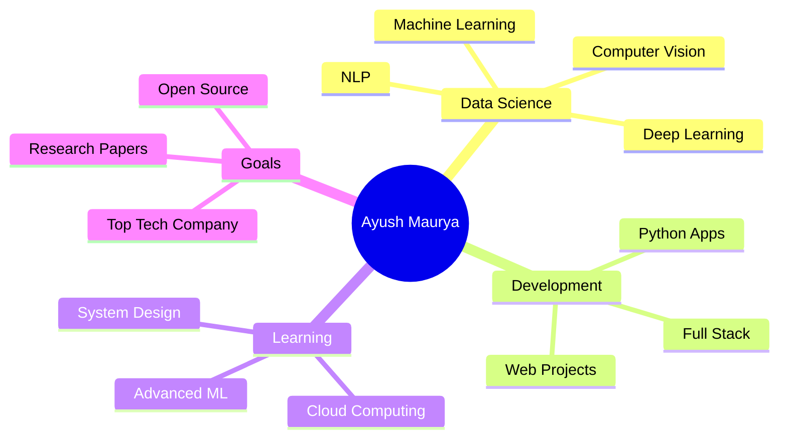

<div align="center">

# 👋 Hi, I'm Ayush Kumar Maurya


[](https://git.io/typing-svg)

</div>

<p align="center">
  
  
  
  
</p>

<div align="center">
  
### 🎓 B.Tech in Computer Science (Data Science)
**Meerut Institute of Engineering and Technology**

💡 **Aspiring Data Scientist** | Passionate about **Data Analytics, Machine Learning & Problem-Solving**  
🌱 Currently upskilling in **Full-Stack Development** and working on **real-world projects**

[](https://ayushmaurya13.github.io/my_data_science_portfolio/)
[](https://www.linkedin.com/in/ayush-kumar-maurya-a43914258/)
[](https://github.com/AyushMaurya13)

</div>

---

## 🚀 About Me

```python
class DataScientist:
    def __init__(self):
        self.name = "Ayush Kumar Maurya"
        self.role = "Data Scientist & ML Engineer"
        self.education = "B.Tech in Computer Science (Data Science)"
        self.language_spoken = ["Hindi", "English"]
        
    def current_work(self):
        return [
            "🛰️ ChurnGuard - ML-based Telecom Churn Prediction System",
            "🌾 Crop Yield Prediction - Agricultural ML Models",
            "🛒 Avadhesh Kirana Store - E-commerce Platform"
        ]
    
    def skills(self):
        return {
            "languages": ["Python", "SQL", "JavaScript"],
            "ml_frameworks": ["TensorFlow", "PyTorch", "Scikit-learn"],
            "data_tools": ["Pandas", "NumPy", "Matplotlib", "Seaborn"],
            "web_dev": ["HTML", "CSS", "React", "Node.js"],
            "tools": ["Git", "Jupyter", "VS Code", "Streamlit"]
        }
    
    def goals_2025(self):
        return "Become a proficient Data Scientist and contribute to impactful AI projects"

me = DataScientist()
print(me.goals_2025())
```

<details>
<summary>📊 More About Me (Click to expand)</summary>

- 🔭 **Currently Working On:**
  - 🛰️ **Tesla Autopilot Computer Vision Pipeline** - 
  - 🌾 **Goldman Sachs Algorithmic Trading Bot** - 
  - 🛒 **Microsoft Azure Cognitive Services** - 

- 🌱 **Currently Learning:**
  - 📊 Advanced Data Science & Machine Learning Techniques
  - 🧠 Deep Learning & Neural Networks
  - ☁️ Cloud Computing (AWS, Azure)

- 🎯 **2025 Goals:**
  - Master Advanced ML Algorithms
  - Build 10+ Production-Ready ML Projects
  - Contribute to Open Source AI Projects
  - Land a Data Science Role at a Leading Tech Company

- ⚡ **Fun Fact:** I love turning complex data into simple, actionable insights!

</details>

---

## 🛠️ Tech Stack & Skills

<div align="center">

### 💻 Programming Languages


### 📊 Data Science & ML


### 📈 Data Visualization


### 🔧 Tools & Platforms


### 🌐 Web Development


</div>

<details>
<summary>🎯 Skill Proficiency (Click to expand)</summary>

| Category | Skills | Proficiency |
|----------|--------|-------------|
| **Machine Learning** | Supervised, Unsupervised, Reinforcement Learning | ⭐⭐⭐⭐⭐ |
| **Deep Learning** | Neural Networks, CNN, RNN, Transfer Learning | ⭐⭐⭐⭐ |
| **Data Analysis** | Pandas, NumPy, Statistical Analysis | ⭐⭐⭐⭐⭐ |
| **Data Visualization** | Matplotlib, Seaborn, Plotly | ⭐⭐⭐⭐⭐ |
| **Python Programming** | Advanced Python, OOP, Algorithms | ⭐⭐⭐⭐⭐ |
| **Web Development** | MERN Stack, HTML/CSS/JS | ⭐⭐⭐⭐ |
| **Database** | SQL, MongoDB | ⭐⭐⭐⭐ |
| **Version Control** | Git, GitHub | ⭐⭐⭐⭐⭐ |

</details>

---

## 📌 Featured Projects

<div align="center">

### 🏆 Production-Ready ML Applications

</div>

<table>
<tr>
<td width="50%">

### 🏥 Medical Insurance Cost Prediction
[](https://medical-insurance-cost-prediction-sek2fnp2yaftamt5auegaq.streamlit.app/)
[](https://github.com/AyushMaurya13)

**Tech Stack:** `Python` `Scikit-learn` `Streamlit` `Pandas`

🎯 **Features:**
- ML-based cost prediction
- Interactive web interface
- Real-time predictions
- Data visualization

📊 **Accuracy:** 85%+

</td>
<td width="50%">

### 🌾 India Crop Yield Prediction
[](https://indiancropyieldprediction-mmwh4csrahy6kqchvcxipm.streamlit.app/)
[](https://github.com/AyushMaurya13)

**Tech Stack:** `Python` `ML Models` `Streamlit` `NumPy`

🎯 **Features:**
- Agricultural yield forecasting
- Multi-crop support
- Weather data integration
- Farmer-friendly UI

📊 **Accuracy:** 88%+

</td>
</tr>

<tr>
<td width="50%">

### 🎥 Netflix Content Recommendation Engine
[ • [Demo](https://6rcuwthpkt3cgf38kmglpy.streamlit.app/)
**Tech Stack:** `Python` `scikit-learn` `streamlit` `Linear Rigreesion`

🎯 **Features:**
- Netlix content prediction
- Include all type of content
- Easy to find Similarity
- Dashboard analytics

🚀 **Status:** Under Development

</td>
<td width="50%">

### 💳 PayPal Fraud Detection System
[ • [Demo](https://f6efrv6uttbd7vpxklzzet.streamlit.app/)
**Tech Stack:** `XGBoost` `scikit-learn` `Machine Learning`

🎯 **Features:**
- Full in working situation
- You can prevent losses
- Very easy to use
- Target the scammers

✨ **Status:** Completed

</td>
</tr>

<tr>
<td width="50%">

### 🌐 Data Science Portfolio
[](https://ayushmaurya13.github.io/my_data_science_portfolio/)
[](https://github.com/AyushMaurya13)

**Tech Stack:** `HTML5` `CSS3` `JavaScript` `Responsive Design`

🎯 **Features:**
- Modern animated UI
- Project showcase
- Skills visualization
- Contact form

✨ **Status:** Live & Updated

</td>
<td width="50%">

### 💡 More Projects Coming Soon...
[](https://github.com/AyushMaurya13?tab=repositories)

🚀 Currently working on:
- NLP Sentiment Analysis
- Computer Vision Projects
- Time Series Forecasting
- Recommendation Systems

⭐ Star my repos to stay updated!

</td>
</tr>
</table>

---

## 📊 GitHub Statistics

<div align="center">


### 🏆 GitHub Trophies
[](https://github.com/ryo-ma/github-profile-trophy)

</div>

---

## 📈 Contribution Graph

<div align="center">

[](https://github.com/ashutosh00710/github-readme-activity-graph)

</div>

---

## 🎯 What I'm Up To



---

## 💼 Professional Journey

<div align="center">


</div>

---

## 🤝 Connect With Me

<div align="center">

### Let's Build Something Amazing Together! 🚀

<a href="https://www.linkedin.com/in/ayush-kumar-maurya-a43914258/" target="_blank">
  
</a>
<a href="https://github.com/AyushMaurya13" target="_blank">
  
</a>
<a href="https://x.com/ayush_maur10241" target="_blank">
  
</a>
<a href="mailto:ayushmaurya01cs@gmail.com">
  
</a>
<a href="https://ayushmaurya13.github.io/my_data_science_portfolio/" target="_blank">
  
</a>

<br><br>

### 📧 Email: ayushmaurya01cs@gmail.com
### 🌐 Portfolio: [ayushmaurya13.github.io](https://ayushmaurya13.github.io/my_data_science_portfolio/)

</div>

---

## 💡 Quote of the Day

<div align="center">


</div>

---

## 🎖️ Achievements & Certifications

- 🏆 **Building ML Projects** - Multiple production-ready applications
- 📊 **Data Science Projects** - 5+ end-to-end ML projects
- 💻 **Web Development** - Full-stack e-commerce applications
- 🎓 **Continuous Learning** - Active on Kaggle, LeetCode, and HackerRank

---

## 📝 Latest Blog Posts

<!-- BLOG-POST-LIST:START -->
- 🚀 Coming Soon: Technical blogs on Data Science & ML
- 📊 Project walkthroughs and tutorials
- 💡 Tips and tricks for aspiring Data Scientists
<!-- BLOG-POST-LIST:END -->

---

## 🌟 Support My Work

<div align="center">

If you find my projects helpful, consider giving them a ⭐!

[](https://github.com/AyushMaurya13)
[](https://github.com/AyushMaurya13)

### "Data is the new oil, and I'm here to refine it!" 🛢️➡️💎

</div>

---

<div align="center">

### 📊 Profile Views Counter


### ⭐ Show Some Love - Star My Repositories!


**Made with ❤️ by Ayush Kumar Maurya**

*Last Updated: October 2025*

</div>  

---


